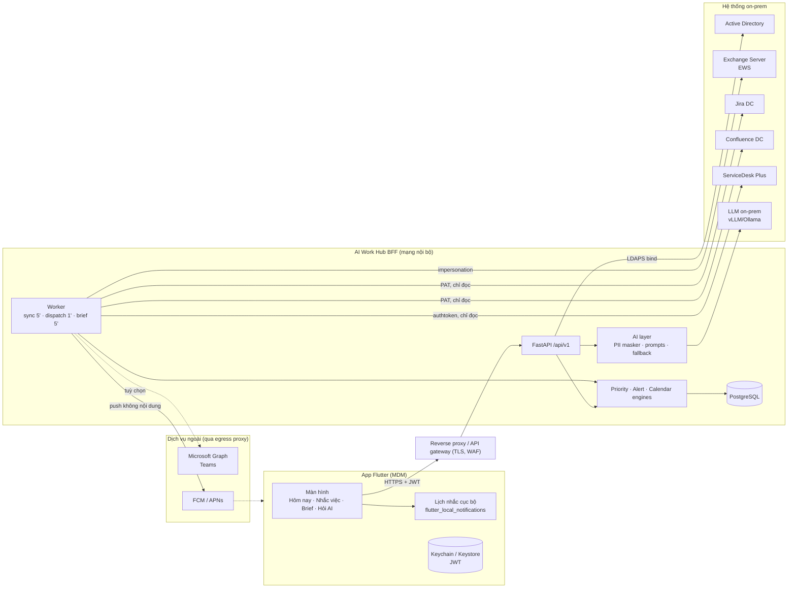

# Kiến trúc AI Work Hub

## 1. Tổng quan



**Nguyên tắc:**
1. App chỉ nói chuyện với BFF. Mọi bí mật kết nối hệ thống nguồn nằm ở BFF (env/Vault).
2. Connector **chỉ đọc**. Thao tác của người dùng (xong / hoãn / đã xem) là trạng thái riêng của AI Work Hub.
3. AI là tầng tăng cường, không phải điều kiện bắt buộc. Mọi tính năng đều có bản dự phòng theo quy tắc khi LLM tắt hoặc lỗi.
4. Dữ liệu gửi sang LLM đã được che PII. LLM đặt on-prem, không gọi ra Internet.

## 2. Luồng dữ liệu

### 2.1 Đồng bộ (worker, mặc định 5 phút/lần)
```
connector.fetch(user) → ItemIn (chuẩn hoá) → upsert WorkItem (giữ done_local/snoozed_until)
  → xoá item nguồn không còn trả về (ticket đã đóng, mail đã đọc…)
  → PriorityEngine.score → AlertEngine.generate → upsert Alert theo group_key
```
- Mỗi connector lỗi độc lập (`ConnectorError`) và không làm hỏng các nguồn khác. Kết quả từng nguồn trả về ở `POST /sync`.
- `group_key` giúp không nhắc trùng. Alert đã `sent`, `acked` hoặc `snoozed` không bị ghi đè khi đồng bộ lại.
- Điểm ưu tiên được **chấm lại tại thời điểm đọc**, nên lý do như "Quá hạn 30 phút" luôn khớp giờ thực.

### 2.2 Gửi nhắc
- Worker quét mỗi phút các alert đã tới giờ (`pending` hoặc `snoozed`), gom theo người dùng rồi gửi **một** push không nội dung ("Bạn có 3 nhắc việc mới (1 khẩn)").
- App lấy danh sách `upcoming` và lên lịch tối đa 48 nhắc cục bộ, cộng 1 nhắc Morning Brief. Nhờ vậy nhắc vẫn báo khi mất VPN hoặc push bị chặn.
- Mặc định thông báo trên máy chỉ có tiêu đề trung tính ("Ticket sắp chạm SLA"). Người dùng có thể bật hiện chi tiết.

### 2.3 Morning Brief
Worker chạy mỗi 5 phút. Từ thứ 2 đến thứ 6, khi tới `brief_time` của từng người, worker tạo brief (một bản/ngày) và gửi push "Morning Brief đã sẵn sàng".
`POST /brief/regenerate` tạo lại theo yêu cầu.

## 3. Engine

### 3.1 PriorityEngine (0–100, có giải thích)
| Nhóm | Quy tắc | Điểm |
|---|---|---|
| Thời gian (việc) | quá hạn / ≤2h / ≤24h / ≤72h | 40 / 35 / 25 / 12 |
| Thời gian (họp) | đang diễn ra hoặc ≤1h / ≤4h / ≤24h; chủ trì +5 | 35 / 22 / 12 |
| SLA | vi phạm / ≤1h / ≤4h / ≤24h | 45 / 35 / 25 / 10 |
| Người yêu cầu | Kiểm toán-Tuân thủ / KH VIP / quản lý / bên ngoài | 20 / 18 / 15 / 5 |
| Ưu tiên gốc | Highest-Critical-Urgent / High / Medium | 20 / 12 / 5 |
| Tín hiệu | blocked 8, incident 6, important 8, flagged 6, @mention 6, chưa đọc 4 | |

Phân nhóm: `critical` ≥ 70, `high` ≥ 45, `normal` ≥ 20, còn lại `low`.
Vai trò người yêu cầu xác định qua `manager` (AD), danh sách VIP do người dùng khai báo (email hoặc tên miền), và từ khoá kiểm toán (`ksnb`, `audit`, `compliance`…).

### 3.2 AlertEngine
| Loại | Khi nào | Mức |
|---|---|---|
| `meeting_soon` | trước giờ họp N phút (mặc định 15) | warning nếu chủ trì hoặc từ quản lý/VIP/kiểm toán |
| `due_soon` | trước hạn 24h, rồi 2h | info → warning |
| `overdue` | đã quá hạn (1 lần/ngày) | warning, critical nếu item critical |
| `sla_risk` / `sla_breached` | trước hạn SLA 2h / đã vi phạm | warning / critical |
| `important_message` | mail/chat chưa đọc từ quản lý, KH VIP, kiểm toán | warning |
| `mention` | @mention trên Confluence/Teams | info |
| `conflict` / `overload` | họp trùng / lịch ≥ 65% giờ làm | warning / info |
| `digest` | > 3 nhắc info rơi vào cùng cửa sổ 10 phút | info |

Giờ yên lặng (mặc định 21:00–07:00): nhắc không khẩn được dời tới cuối giờ yên lặng. `critical` vẫn báo ngay.

### 3.3 CalendarInsights
Tính trùng lịch, tổng thời lượng họp (đã hợp các khoảng chồng nhau), chuỗi ≥ 3 cuộc họp liền nhau (nghỉ < 10 phút), và khung giờ trống ≥ 90 phút trong 08:00–17:30 (trừ 12:00–13:00). Với ngày hôm nay, khung giờ trống chỉ tính từ thời điểm hiện tại.

## 4. AI

| Tính năng | Đầu vào LLM | Đầu ra | Kiểm soát |
|---|---|---|---|
| Morning Brief | dữ kiện đã tính sẵn + 12 item điểm cao (đã che PII) | JSON: headline, top_priorities[item_id, why], risks, suggestions | Bỏ item_id không có thật, cần ≥ 2 mục hợp lệ thì mới thay Top 3 |
| Ask AI | ≤ 10 item tìm được bằng nhận diện ý định + từ khoá không dấu | văn bản kèm `[#id]` | Rate limit 20 lần/phút/người |
| Meeting Prep | cuộc họp + item liên quan (Jira key trong thư mời, tiêu đề Confluence được dẫn, chủ đề trùng, việc của người dự) | JSON: purpose, talking_points, questions | Nhiệt độ thấp. Lỗi thì dùng bản theo quy tắc |

**PiiMasker** che theo thứ tự: email → SĐT VN (`0|+84` + đầu số di động) → chuỗi số 8–19 chữ số (thẻ nếu qua Luhn, CCCD 12 số, CMND 9 số, còn lại là STK).
Không coi `-` là phân cách số, để ngày dạng `2026-10-08` và mã Jira không bị che nhầm.
Token có dạng `[SĐT_1]`. Cùng giá trị luôn ra cùng token, và được khôi phục sau khi LLM trả lời.

Mô hình gợi ý: Qwen2.5-14B/32B-Instruct hoặc Llama-3.1-8B/70B-Instruct (tiếng Việt tốt), chạy bằng vLLM trên GPU nội bộ.

## 5. Phân quyền & dữ liệu

| Hệ thống | MVP | Khuyến nghị production |
|---|---|---|
| Exchange | Impersonation, giới hạn bằng Management Scope theo group AD | Giữ nguyên, rà soát scope định kỳ |
| Jira / Confluence | Service account đọc + lọc theo username | OAuth 2.0 (incoming application link) hoặc PAT cho từng người, để quyền xem trùng quyền cá nhân |
| SDP | Technician key đọc + lọc `technician.email_id` | Key riêng có phạm vi site/nhóm |
| Teams | Graph application permission (tắt mặc định) | Resource-specific consent hoặc delegated token |

- `WorkItem.preview` chỉ lưu tối đa 600 ký tự. Nên mã hoá cột này hoặc bật TDE ở production.
- Audit log ghi: login (thành công/thất bại), sync thủ công, đánh dấu xong, tạo brief, ask (chỉ số lượng kết quả), meeting prep.
- Mọi endpoint kiểm tra `username` của item/alert, nên người dùng khác nhận 404 (có test bảo đảm).

## 6. Triển khai đề xuất
```
[App (MDM, VPN per-app)] → [WAF / API gateway (TLS, rate limit)] → [BFF x2 (stateless)] → [PostgreSQL HA]
                                                                → [Worker x1 (hoặc nhiều + lock)]
                                                                → [vLLM GPU node]
```
- BFF stateless, scale ngang được. Rate limit của Ask nên chuyển lên gateway hoặc Redis khi chạy nhiều instance.
- Worker chạy đơn lẻ, hoặc nhiều instance kèm advisory lock của PostgreSQL.
- Theo dõi: `/health`, log JSON, số lỗi theo connector, độ trễ LLM.

## 7. Giới hạn hiện tại
- Chưa ghi ngược về hệ thống nguồn (chấp nhận họp, chặn focus time, chuyển trạng thái ticket).
- Jira Service Management SLA chưa map (chỉ SDP). Có thể bổ sung bằng custom field SLA của JSM.
- Confluence chưa lấy inline task (`/rest/inlinetasks`). Hiện chỉ lấy mention và watch.
- App chưa tích hợp `firebase_messaging` (cần file cấu hình Firebase của ngân hàng). Hiện app dựa vào lịch nhắc cục bộ và đồng bộ khi mở app.
- Cột `user_settings.live_sim_enabled` chỉ được thêm tự động khi `APP_ENV=dev` (`ensure_dev_columns`). CSDL không phải dev đang chạy phải chạy tay `ALTER TABLE user_settings ADD COLUMN live_sim_enabled BOOLEAN NOT NULL DEFAULT TRUE;` trước khi triển khai phiên bản này, nếu không mọi truy vấn cài đặt trả HTTP 500. Cần Alembic để quản lý việc này.

## 8. Luồng sự kiện giả lập (chỉ MOCK)

1. `worker.job_sim_tick` (10 giây/lần) hỏi `SimTicker`; user nào bật `live_sim_enabled` và đã tới lượt thì `simulator.emit`.
   `POST /sim/emit` gọi cùng hàm này trong tiến trình API (hai tiến trình dùng chung DB, không cần IPC).
2. `emit` chọn kịch bản theo persona và nguồn đang bật → ghi `live_events` → upsert `WorkItem` → `recompute()` (chấm điểm + sinh `Alert`)
   trong một transaction.
3. `MockConnector.fetch` = dữ liệu gốc + item dựng lại từ `live_events` (mốc thời gian lưu dạng offset so với `created_at`),
   nên lần sync 5 phút không xoá dữ liệu giả lập.
4. App poll `GET /events?since=<con trỏ>` mỗi 8 giây khi ở foreground; có sự kiện thì invalidate Today/Alerts/Brief và hiện banner.
   Nếu `latest_id` của server nhỏ hơn con trỏ (sau reset) app hạ con trỏ xuống.
